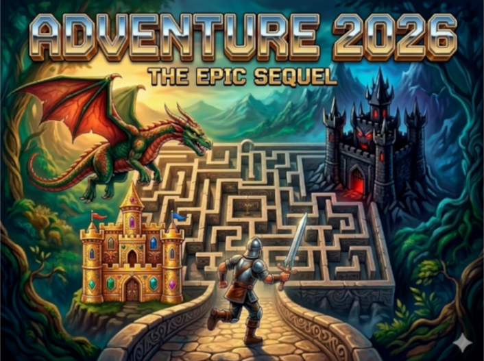
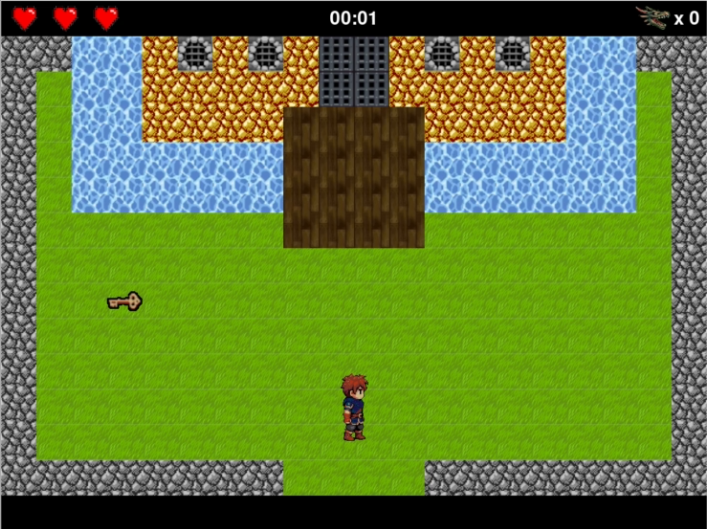
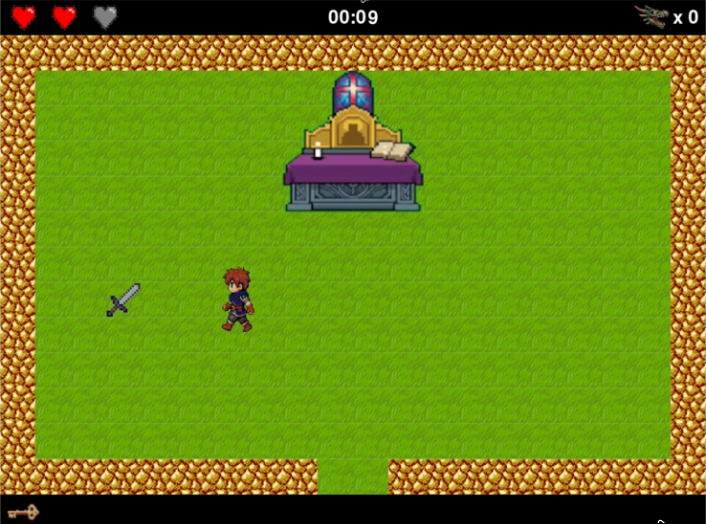
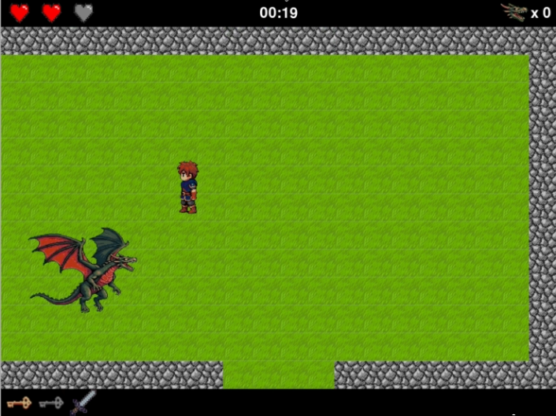
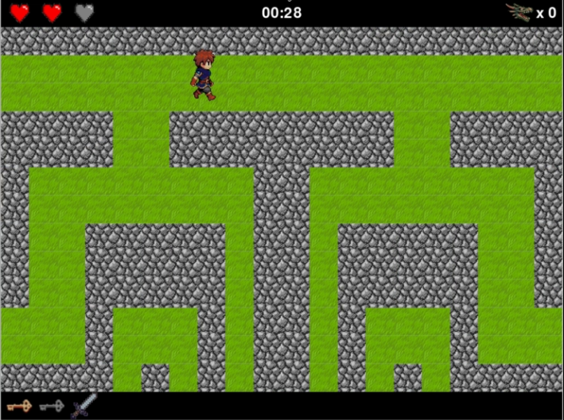
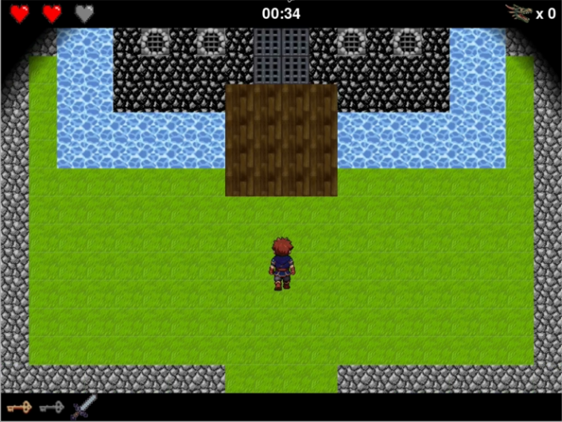
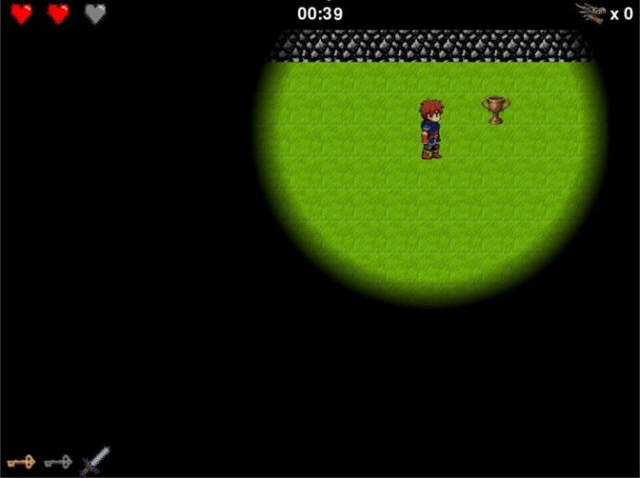

# Adventure 2024

Homenaje pygame al Atari 2600 — juego de exploración, laberintos y dragones.



## Capturas

| | | |
|:---:|:---:|:---:|
|  |  |  |
|  |  |  |

## Requisitos

- Python 3.10+
- [pygame](https://www.pygame.org/) 2.6+
- [Pillow](https://python-pillow.org/)
- [PyQt5](https://www.riverbankcomputing.com/software/pyqt/) (solo para el editor)

```bash
pip install pygame Pillow PyQt5
```

## Ejecución

```bash
# Juego
python3 main.py

# Editor de mundos
python3 editor.py
```

Ambos programas deben ejecutarse desde la raíz del repositorio.

## Controles del juego

| Tecla | Acción |
|---|---|
| `Flechas` | Mover al héroe |
| `F11` | Pantalla completa / ventana |
| `F1` | Cargar mundo |
| `F2` | Reinicio instantáneo |
| `ESC` | Menú de pausa |

## Objetivo

Explorar las salas, esquivar o derrotar al dragón, encontrar el **trofeo** y llevarlo al **altar** para ganar.

## El dragón

El dragón está siempre presente y persigue al héroe. Si llevas la **espada**, el dragón mantiene distancia y orbita a ~500 px. Si no la llevas, se acerca hasta colisionar. Tras golpear, se congela 1 segundo. Al cambiar de sala, se reubica automáticamente.

## Editor de mundos

Editor gráfico PyQt5 para crear y editar mundos:

- **Pincel**: selecciona un elemento y pinta con clic izquierdo.
- **Borrar**: clic derecho (pone hierba).
- **Zonas de borde**: clic en los bordes para ajustar conexiones entre salas, visibilidad y dragón.
- **Crear elementos**: diálogo para definir char, nombre, imagen, solidez, tipo e ID de inventario.
- **Guardar/Cargar**: `S`/`L`, o los botones de la barra inferior.

Ver [INSTRUCTIONS.md](INSTRUCTIONS.md) para instrucciones detalladas.

## Estructura del proyecto

```
├── main.py                  # Juego completo (~1200 líneas)
├── editor.py          # Editor PyQt5 (~800 líneas)
├── core/
│   ├── elements.py          # Definición y consulta de elementos
│   └── elements.json        # Datos de todos los elementos + reglas
├── worlds/
│   └── atari_2600_world_1.py  # Mundo por defecto (14 salas)
├── assets/
│   ├── images/              # Sprites y tiles del juego
│   ├── sounds/              # Efectos de sonido WAV
│   └── screenshots/         # Capturas para el README
├── INSTRUCTIONS.md          # Instrucciones completas del juego y editor
├── AGENTS.md                # Documentación técnica del proyecto
└── obsolete/                # Prototipos antiguos (ignorado por git)
```

## Formato de mundos

Los mundos son archivos Python con datos puros. Cada sala:

```python
maps.append([[up, right, down, left], [grid_rows...], dragon, visibility])
```

- **Conexiones**: números de sala (0-indexados); `-1` = sin conexión. Orden: arriba, derecha, abajo, izquierda.
- **Cuadrícula**: 20 columnas × 13 filas de caracteres (ver [INSTRUCTIONS.md](INSTRUCTIONS.md) para la leyenda completa).
- **Visibilidad**: radio de niebla; ≥ 1000 = sin niebla.

## Elementos disponibles

| Char | Elemento | Sólido |
|:---:|---|:---:|
| ` ` | Hierba | No |
| `X` | Roca | Sí |
| `B` | Madera | No |
| `W` | Agua (animada) | Sí |
| `D` / `d` | Puerta dorada / negra | Sí |
| `K` / `b` | Llave dorada / negra | No |
| `S` | Espada | No |
| `T` | Trofeo | No |
| `A` | Altar (4×4) | Sí |

Se pueden crear elementos personalizados desde el editor.

## Licencia

Pendiente.
